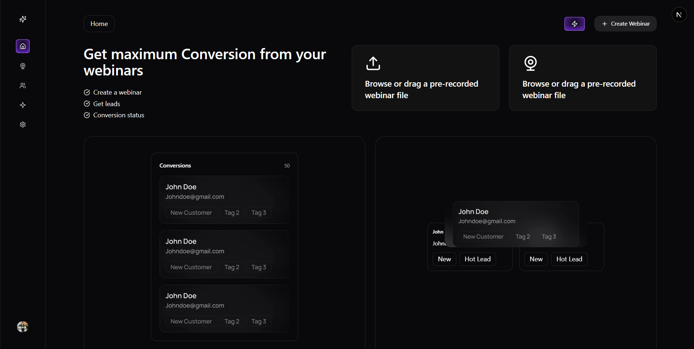

# Sarthi – AI Powered Webinar Streaming & Sales Platform 📈


Sarthi is an AI powered webinar streaming platform for marketers and business owners. Users can create webinars, show popup screens to attendees to book a call or buy a product during the livestream, track lead sales and sales progress and more.

The "book a call" CTA works best for high ticket services / or courses! The host can create breakout rooms for interested prospects and the AI sales agent can speak to leads and even close leads with the product link.

This AI sales agent can be trained and customized as per your liking.

Hosts can also track the progress of their leads in their sales cycle, and follow up with them to push a sale.

---


## Table of Contents

- [Demo](#demo)
- [Features](#features)
- [Tech Stack](#tech-stack)
- [Getting Started](#getting-started)
- [Environment Variables](#environment-variables)
- [Usage](#usage)
- [Contributing](#contributing)
- [License](#license)
- [Contact](#contact)

---

## Demo

### **Platform Demo Video**


https://github.com/user-attachments/assets/3b2cf703-d567-47fa-88fa-ce5e8e2ff002


### **Screenshots**


---

## Features

- 🎥 Live streaming Webinars
- 🔁 Create unlimited streams
- 🎛️ Stream through OBS for full customization or camera
- 💳 Connect Stripe product
- 🛒 Sell products on the webinar through CTAs
- 🤖 Create AI agents
- 📈 Webinar signup funnel to get leads
- 🧩 Lead tracking and pipelines
- 🧠🔀 Add AI agents to break out rooms
- 🗣️🤝 AI agents can role play as setters / sales reps and more
- 🤖✅ Close leads on auto pilot with AI agents
- 📼 Access previous recordings of webinars *
- 💸 Single line Stripe payment component
- 💰 Accept payments from customers
- 🚀 Production grade deployment on custom VPS
- 🐳 Docker file for npm & bun
- 📤 Resend sending emails
- 🧩 Beautiful Minimal dark mode UI

---


## Tech Stack

- **Frontend**: Next.js 15, TailwindCSS, Shadcn UI  
- **Backend**: Node.js, Express
- **AI**: Vapi AI for AI agents, CoPilot (voice agent logic), Pinecone for vector storage
- **Auth**: Clerk
- **Database**: PostgreSQL via Neon, ORM with Prisma
- **Payments**: Stripe (with waitlist and one-click checkout)
- **Streaming**: OBS/WebRTC integration, Stream SDK for video sessions

---

## Getting Started

```bash
# Clone the repo
git clone https://github.com/Tushartime/Sarthi.git
cd Sarthi
```

### Install dependencies
```
npm install
```

### Start the dev server
```
npm run dev
```

---

## Environment Variables
Create a `.env` file in the root directory and add the following:

```
DATABASE_URL=your_postgres_url
CLERK_SECRET_KEY=your_clerk_key
OPENAI_API_KEY=your_openai_key
PINECONE_API_KEY=your_pinecone_key
STRIPE_SECRET_KEY=your_stripe_key
RESEND_API_KEY=your_resend_key
NEXT_PUBLIC_BASE_URL=http://localhost:3000
```

---

## Usage

1. Create a webinar from your dashboard.
2. Share the live webinar link with your audience.
3. Add in-stream CTAs like "Book a Call" or "Buy Now" using the editor.
4. Enable breakout rooms for high-intent leads to interact with the AI sales agent.
5. Train your AI sales agent using a custom prompt.
6. Monitor lead activity, track progress through your sales funnel, and follow up as needed.

---

## Contributing

We welcome contributions from the community! Here's how you can help:

- 🐛 Report bugs
- ✨ Suggest features
- 📂 Submit pull requests

Please fork the repo and create a branch for your feature or bug fix. Once done, open a PR with a clear explanation of your changes.

---

## License

This project is licensed under the [MIT License](LICENSE).

---


